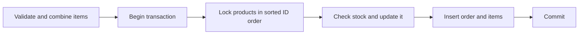

# Parallelism, async, and database calls

This chapter connects the teaching implementations to practical work. Run each example, explain what owns each value, then alter one failure condition and retest.

## Choose the right kind of concurrency

| Work | Use | Why | Common mistake |
| --- | --- | --- | --- |
| Compute many independent results | Rayon or a thread pool | Several CPU cores can execute at once | Adding threads to work too small to repay scheduling overhead |
| Wait on many sockets, timers, or queries | Tokio tasks and `.await` | One worker can schedule other tasks while a task waits | Blocking an async worker with long CPU work or `std::thread::sleep` |
| Protect shared mutable data | Ownership transfer first; lock only if needed | Shared locks introduce contention and possible deadlocks | Putting one global `Mutex<HashMap<...>>` around every operation |
| Limit pressure on a service | Bounded tasks, pool size, timeout | Prevents unlimited memory and connection demand | Spawning all requests, then waiting on a semaphore inside each one |

### CPU parallel exercise

Read `projects/concurrency_lab/src/lib.rs`. The sequential counter owns one `HashMap`. Rayon's `fold` gives each worker its own map, and `reduce` merges them. There is no mutable map shared by all workers. Compare both on a small file and a large file:

```text
cargo run --release -p concurrency_lab -- text README.md
cargo run --release -p concurrency_lab -- text path/to/large.txt
```

The printed times are a quick observation, not a benchmark. Repeat runs and compare with Criterion before claiming a speedup. Track input size and CPU count. For small input, Rayon overhead can exceed the saved work.

### Async exercise

`map_bounded` starts at most `limit` Tokio tasks. It starts another only after one completes. Its output slots restore input order, even if completion order differs. A caller can wrap each operation in `tokio::time::timeout`; a timeout is a value the caller handles, while a task panic becomes `JoinError`. Dropping the outer future drops its `JoinSet` and requests cancellation of children. Cancellation is cooperative, so CPU loops without `.await` require a separate strategy.

```text
cargo run -p concurrency_lab -- async
```

Change the simulation to a local HTTP request. Measure peak in-flight requests, total elapsed time, timeout count, and memory usage. Compare limits of 1, 4, and 32. A higher limit can reduce throughput if it saturates the downstream service.

## Database transaction exercise

Read `enterprise_backend/src/repository/order_repo.rs` and trace the order flow:



The transaction makes stock updates and order inserts one unit. A failed stock check or arithmetic overflow returns before commit, so the transaction rolls back. `SELECT ... FOR UPDATE` makes competing orders wait for the same product row; the second order sees the updated stock. Sorting product IDs gives overlapping orders a consistent lock order, reducing deadlocks. The backend also combines repeated product lines before locking, so a duplicate cannot bypass stock checks. Checked multiplication and addition prevent large prices or quantities from wrapping the total.

The order list fetches parent orders and all their items with two queries. The previous loop issued one item query per order, which grows to N+1 round trips. This is a query-count improvement; the endpoint can still return an unbounded number of orders. Pagination and a stable cursor are the next step.

Product updates use one `UPDATE` with `COALESCE` for omitted fields. This prevents two requests changing different fields from overwriting each other's work through a read-then-full-write sequence. `stock_quantity` is still an absolute admin-set value; inventory adjustments need a separate operation with explicit business rules.

### Run live database tests

Normal backend tests have no service dependency. The optional tests use SQLx to create an isolated PostgreSQL database per test and apply migrations. Use a disposable PostgreSQL instance and a role allowed to create databases. From `enterprise_backend/`, set `DATABASE_URL`, then run:

```text
cargo test --features db-integration --test db_integration
```

The tests place two orders for the last item at once and verify exactly one succeeds. They also verify duplicate lines, totals, stock, list hydration, and concurrent edits to different product fields. These tests were compiled here; they require a live PostgreSQL server to execute.

### Inspect query behavior

Use `EXPLAIN (ANALYZE, BUFFERS)` on representative list queries in a disposable database. Check whether the indexes match the filter and sort, how many rows are read, and whether the query count grows with result size. Record pool wait time and query latency separately; increasing pool size cannot fix a slow query. Avoid running `EXPLAIN ANALYZE` on write queries against valuable data because it executes them.

## Practice milestones

1. Extend the Tokio cancellation test to cover a blocking CPU loop, then explain why abort cannot stop it promptly.
2. Replace the async demo's timer with a local TCP or HTTP server. Add a timeout and retry only for operations safe to repeat.
3. Add keyset pagination to the order list using `(created_at, id)` as a stable cursor. Add a matching database index and compare query plans.
4. Add a bounded background worker for an idempotent task. Define what happens on shutdown, panic, retry, and duplicate delivery.
5. Run the PostgreSQL tests, then add a test where two orders lock the same two products in opposite input order.
